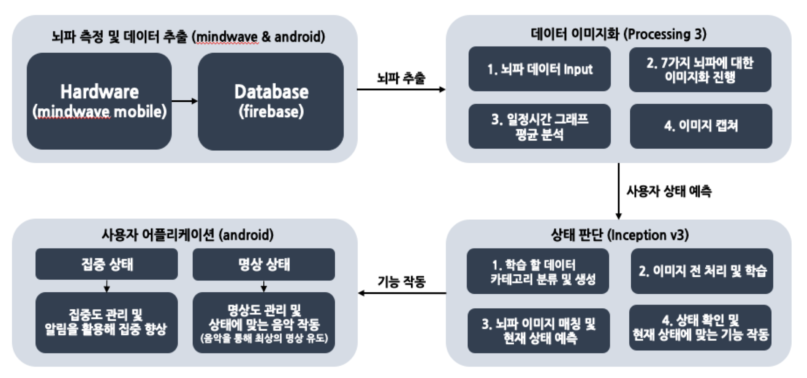
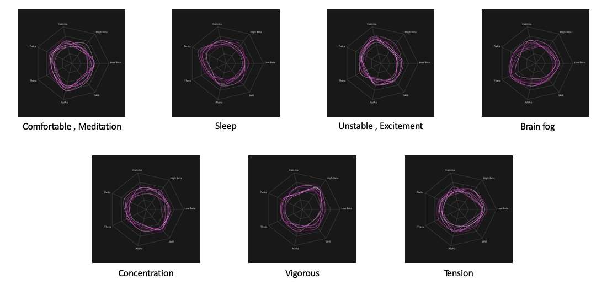

# 뇌파를 활용한 집중, 명상 관리 및 개선 프로그램
* 최상의 명상 상태를 만들어 최대의 집중을 발휘하도록 도움을 주는 프로그램

## 1. 환경설정
1. 하드웨어
* Neurosky mindwave mobile

2. 소프트웨어
* OS : Window 10
* Language : java 9.0.4 , python 3.6.5
* Tool : android studio 3.1.2, processing 3.3.7 , Tensorflow 1.8.0
* Database : firebase

## 2. 기능
1. 뇌파를 활용해 자신의 현재 상태를 예측
2. ADHD 환자 치료 및 집중, 명상 관리
3. 컨텐츠를 통해 최상의 명상상태를 만들어 최대의 집중력 발휘
4. 과거 사용자의 상태를 분석하고 관리

## 3. 시스템 구조

## 4. EEG 상태 분류

## 5. 데모영상
* Concentration : https://www.youtube.com/watch?v=dfZOyYe7csc
* Meditation : https://www.youtube.com/watch?v=OjPslGXAh8Y
* Management : https://www.youtube.com/watch?v=Us6FA3wGbLQ

